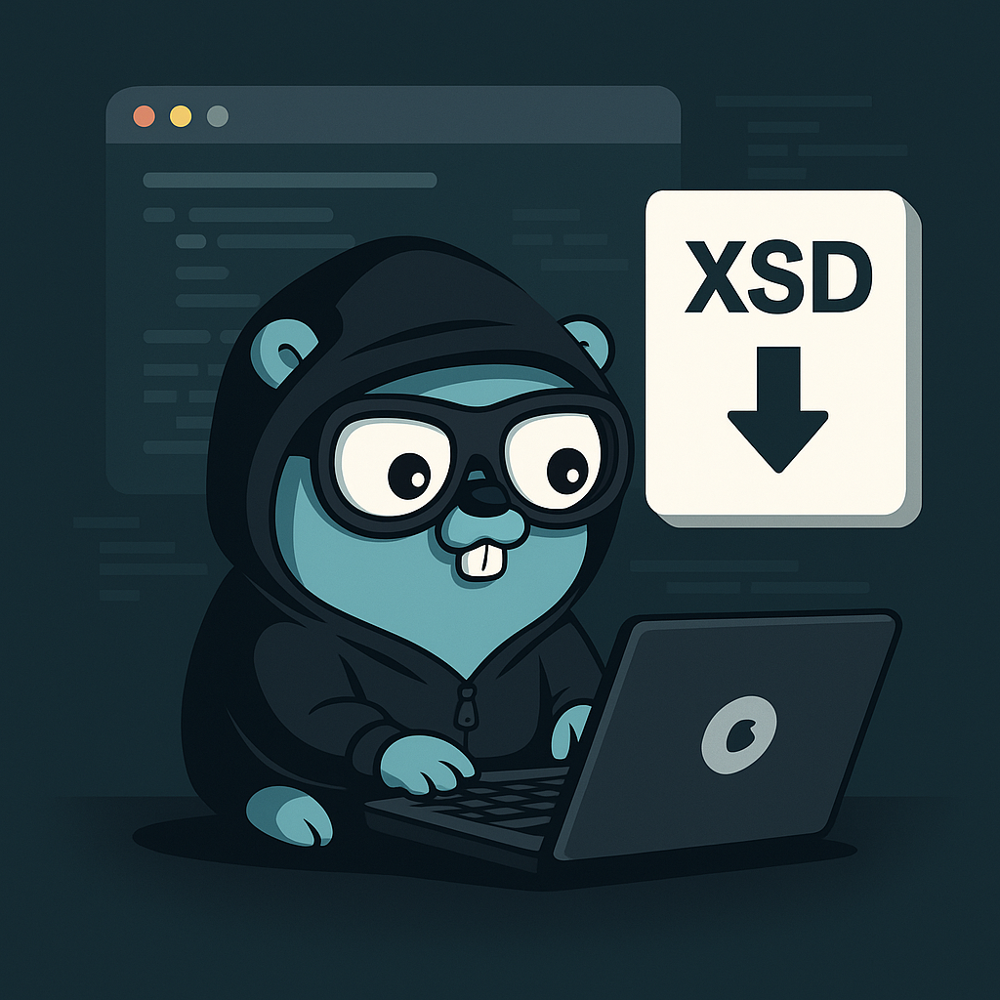

# 🧾 Sefaz Scraper Golang

<p align="center">
  
  
  
  
</p>



Scraper em Go que acessa diretamente o portal da SEFAZ, baixa todos os arquivos **XSD** disponíveis e organiza tudo em uma pasta atualizada no repositório.  
Além disso, o projeto já está preparado para rodar em **GitHub Actions** e manter esses XSD sempre atualizados automaticamente.

Perfeito para projetos que trabalham com **NF-e / CT-e / MDF-e / eventos SEFAZ** e querem ter os XSD localmente, versionados e sempre atualizados.

---

## 🚀 Visão geral

- Faz scraping do site da SEFAZ usando **Chromedp** (controle de Chrome/Chromium via código).
- Usa **goquery** para parsear o HTML e localizar os links dos XSD.
- Faz download dos XSD e salva tudo em uma pasta configurável (ex: `./schemas`).
- Pode ser rodado localmente **ou** via **GitHub Actions** em um agendamento (cron) para manter o repo sempre atualizado.
- Ideal para ser usado como **submódulo** ou **módulo auxiliar** em outros projetos fiscais.

---

## 🧠 Stack

- **Linguagem:** Go `1.24.0`  
- **Toolchain:** `go1.24.10`

### Dependências principais

```go
require (
    github.com/PuerkitoBio/goquery v1.11.0
    github.com/chromedp/cdproto    v0.0.0-20250724212937-08a3db8b4327
    github.com/chromedp/chromedp   v0.14.2
)
```

Dependências indiretas:

```go
require (
    github.com/andybalholm/cascadia      v1.3.3 // indirect
    github.com/chromedp/sysutil         v1.1.0 // indirect
    github.com/go-json-experiment/json  v0.0.0-20250725192818-e39067aee2d2 // indirect
    github.com/gobwas/httphead          v0.1.0 // indirect
    github.com/gobwas/pool              v0.2.1 // indirect
    github.com/gobwas/ws                v1.4.0 // indirect
    golang.org/x/net                    v0.47.0 // indirect
    golang.org/x/sys                    v0.38.0 // indirect
)
```

---

## 📂 Estrutura

```bash
sefaz-scraper/
├─ main.go        # Ponto de entrada CLI
├─ schemas/             # Pasta gerada com os XSD baixados
├─ .github/
│  └─ workflows/
│     └─ update-xsd.yml # GitHub Action para atualização automática
├─ go.mod
└─ README.md
```

> A pasta `schemas/` é onde os XSD baixados serão salvos.  
> Ela pode ser versionada e usada diretamente por outros projetos.

---

## 🔧 Como usar localmente

### 1. Clonar o repositório

```bash
git clone https://github.com/fabyo/sefaz-scraper.git
cd sefaz-scraper
# se quiser compilar: "go build -o scraper main.go"
go mod tidy
```

### 2. Rodar o scraper

```bash
go run ./sefaz-scraper
```

Ou, se já estiver com **binário**:

```bash
./scraper
```

### 3. Parâmetros / Configuração (exemplo)

Exemplos de configurações que podem existir:

- `--output-dir` ou `SEFAZ_SCRAPER_OUTPUT_DIR` para definir a pasta onde os XSD serão salvos.
- `--headless=false` para rodar com Chrome visível (debug).
- `--system=nfe` para filtrar somente um tipo de documento, se implementado.

Exemplo:

```bash
go run ./cmd/sefaz-scraper --output-dir=./schemas --headless=true
```

---

## 🤖 Atualização automática com GitHub Actions

A ideia é simples:  
O GitHub Actions roda o scraper periodicamente, e se houver mudança nos XSD, ele faz commit no próprio repositório e cria um release novo.

### Exemplo de workflow (`.github/workflows/update-xsd.yml`)

```yaml
name: Update SEFAZ XSDs

on:
  schedule:
    - cron: "0 3 * * 1" # Toda segunda-feira às 03:00 UTC
  workflow_dispatch:    # Permite rodar manualmente também

jobs:
  update-xsd:
    runs-on: ubuntu-latest

    steps:
      - name: Checkout
        uses: actions/checkout@v4

      - name: Setup Go
        uses: actions/setup-go@v5
        with:
          go-version: '1.24.0'

      - name: Run sefaz-scraper
        run: |
          go run ./cmd/sefaz-scraper --output-dir=./schemas

      - name: Commit changes if any
        run: |
          if [ -n "$(git status --porcelain)" ]; then
            git config user.name "github-actions[bot]"
            git config user.email "41898282+github-actions[bot]@users.noreply.github.com"
            git add schemas
            git commit -m "chore: update SEFAZ XSDs"
            git push
          else
            echo "Nenhuma alteração nos XSD."
          fi
```

---

## 🧩 Integração com outros projetos

Você pode usar este repo de algumas formas:

1. **Submódulo Git**  
   Adicionar como submódulo dentro do seu projeto fiscal (NFe, CT-e, etc.) e apontar o código para a pasta `schemas/`.

2. **Importando como módulo Go**  

   ```go
   import "github.com/fabyo/sefaz-scraper"
   ```

3. **Somente XSD versionado**
   Usar apenas a pasta `schemas/` como fonte “confiável” de XSD sempre atualizados.
---

## ✅ Objetivo

- Ter um repositório que **sempre** tenha os XSD oficiais da SEFAZ atualizados.
- Ser fácil de plugar em qualquer projeto que precise validar XML de NFe/CT-e/MDF-e.
- Evitar cópia manual de XSD e fontes desatualizadas.

---

## 🤝 Contribuindo

- Abra **issues** com sugestões de melhorias.
- Envie **PRs** com correções e melhorias no scraping.
- Ajude a manter a estrutura de pastas organizada e padronizada.

---

> Projeto pensado para quem trabalha com documentos fiscais eletrônicos e quer **controle total** sobre os XSD e que seja independente de linguagem de programação, com atualização automatizada e versionamento limpo.
